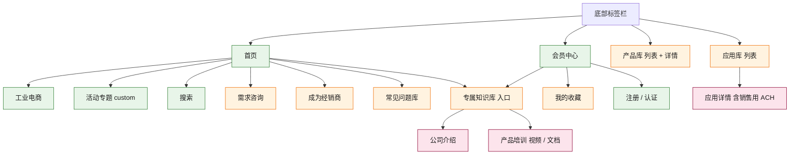

# ITW PPF 小程序产品开发文档

2026-10-03 · Jiayuan Li

## 1. 项目概述

ITW PPF 小程序面向经销商、客户和 ITW 员工，集中提供行业应用方案、品牌产品库、专属知识库和需求咨询入口。本文档依据《小程序操作逻辑需求\_逐页回复20260922》、ITW 反馈 PPT、Jiayuan 提供的七大行业表和 ITW 产品表整理，与当前可点击原型一致。

| 项目 | 内容 |
| --- | --- |
| 平台 | 微信原生小程序（WXML / WXSS / JS） |
| 后端 | 腾讯云开发 CloudBase（数据库、云函数、云存储） |
| 品牌色 | #8B0033 |
| 当前状态 | 前端完成，使用测试数据，未接后端 |
| 前端代码 | GitHub 仓库 [LexieJL/itw-ppf-mp](https://github.com/LexieJL/itw-ppf-mp)（含 README） |
| 可点击原型 | [https://lexiejl.github.io/itw-ppf-mp/](https://lexiejl.github.io/itw-ppf-mp/) |

范围：本期包含 PPT 第 2–15 页的前台页面、ITW 反馈新增的可配置页面和常见问题库，以及第 16–20 页描述的运营后台和 CRM 同步。工业电商为跳转外部小程序，不在本期开发范围。

## 2. 用户角色与权限

小程序有四类身份，内容按三档权限控制，没有仅限员工的内容（ITW 已确认）。

| 角色 | 如何获得 | 可访问权限 |
| --- | --- | --- |
| 游客 | 未注册 | 未注册可见（public） |
| 普通会员 | 填写注册表单 | + 所有用户可见（registered） |
| 认证会员（经销商及客户） | 提交认证，销售在 CRM 中确认 | + 有权限用户（certified） |
| ITW 员工 | 用企业邮箱注册并验证 | 与认证会员相同 |

| 内容 | 游客 | 普通会员 | 认证会员 / 员工 |
| --- | --- | --- | --- |
| 首页、Banner、工业电商、搜索、活动专题 | 可看 | 可看 | 可看 |
| 应用库列表、产品库（列表 + 详情）、收藏、知识库入口、需求咨询、成为经销商、常见问题库 | 遮罩，提示注册 | 可看 | 可看 |
| 应用详情（含销售用 ACH 源文件）、公司介绍、产品培训（视频 / 文档） | 遮罩，提示注册 | 遮罩，提示认证 | 可看 |

**无权限时的处理**：页面内容做高斯模糊，弹出提示。游客提示「注册」，普通会员提示「身份认证」，认证审核中的用户提示「认证申请审核中」。首页点模块弹出的遮罩可以关闭，其余页面的遮罩不可关闭。

**权限字段**：每条内容和每个模块都带 access（public / registered / certified），由运营后台设置；云函数返回数据前再校验一次，前端遮罩只是展示。

**测试阶段开关**（上线前都改为 false）：

- ALLOW\_EMPTY：注册表单所有字段可以留空提交，填了的手机号、邮箱、验证码仍检查格式。
- AUTO\_CERTIFY：提交认证后直接提示「认证成功」并成为认证会员，不走销售审核。
- 会员中心底部的测试用身份切换，上线前删除。

## 3. 信息架构

小程序底部有 4 个标签：首页、应用库、产品库、会员中心；专属知识库从首页模块和会员中心进入。微信原生标签栏只在这 4 个页面显示，二级页面靠左上角返回。

图例：绿色 = 所有人可见（public），橙色 = 注册可见（registered），红色 = 认证会员和员工可见（certified）。

应用详情和专属知识库内容需要认证，其余大部分页面注册即可查看。

| 页面 | 代码目录 | PPT 页 |
| --- | --- | --- |
| 首页 | pages/index | 2–3 |
| 成为经销商 | pages/dealer | 4 |
| 应用库 / 应用详情 | pages/apps、pages/app-detail | 5–6 |
| 产品库 / 产品详情 | pages/products、pages/product-detail | 7 |
| 会员中心 | pages/member | 8、15 |
| 我的收藏 | pages/favorites | 9 |
| 专属知识库、公司介绍 | pages/kb、pages/kb-company、pages/kb-article | 10–11 |
| 产品培训（视频 / 文档 / PDF） | pages/kb-training、pages/kb-list、pages/kb-video、pages/kb-doc | 12–13 |
| 需求咨询 | pages/inquiry | 14 |
| 注册 | pages/register | 15 |
| 搜索浮窗 | pages/search | 全局 |
| 常见问题库 | pages/faq | ITW 反馈 |
| 自定义页面（活动专题） | pages/custom | ITW 反馈 |
| 公众号推文 | pages/webview | 3、6 |

## 4. 功能需求（逐页）

每页右下角都有「搜索」「收藏」浮窗；详情页底部有收藏、转发、需求咨询三个按钮。以下按页面列出内容和规则，括号内为 PPT 页码。

### 4.1 首页（第 2–3 页）

- 轮播图：每张有类型标签（公众号推文 / 活动专题）、标题、副标题，自动轮播 4 秒；点击按后台配置跳转。
- 游客可见注册提示条「注册会员，解锁全部专属服务」，点击进入注册。
- 8 个模块两列卡片：应用库、产品库、专属知识库、需求咨询、成为经销商、工业电商、常见问题库、活动专题。每张卡片 = 线性图标 + 浅色底 + 名称 + 说明。
- 游客点非公开模块：页面模糊 + 注册提示（可关闭）；卡片右上角显示「注册」小标签。
- 模块顺序、显示隐藏、名称、图标、颜色、跳转、权限都由后台配置。

### 4.2 应用库（第 5–6 页）

- 列表：左侧固定栏为七大行业，上方横滑栏为细分领域；右侧先显示该细分领域的总体描述，再显示应用卡片。普通会员可看列表，详情需要认证。
- 详情：面包屑（行业 > 细分领域 > 应用）、应用描述、应用图示、相关公众号推文（横滑）、应用视频、单页 PDF、销售用 ACH 源文件。单页和 ACH 跳转到专属知识库的文档查看页。

### 4.3 产品库（第 7 页）

- 顶部搜索：按产品名、代码、系列、品牌（含中文名）搜索。
- 左侧品牌栏：英文名 + 中文名，按产品数排序；没有产品的品牌排在最后，只显示介绍。
- 上方横滑栏：「全部」+ 该品牌的产品系列。
- 右侧顶部品牌卡片：logo、名称、产品数、中文介绍（默认 3 行，点击展开）。下方为产品卡片（产品图、名称、系列、规格数）。
- 产品详情：面包屑（品牌 > 系列 > 产品）、产品图、品牌 logo、新品标签、产品概述、使用方法和用途、代码与规格表、适用市场与领域标签、产品视频、需求咨询入口。

### 4.4 专属知识库（第 10–13 页）

- 入口页两个板块：公司介绍、产品培训，都需要认证会员。
- 公司介绍：列表 + 图文详情（后台富文本上传）。
- 产品培训：分视频类（SOP 视频、VR 视频）和文档类（手册、单页、ACH、其他），都用与应用库相同的行业 / 细分领域导航。「市场对应的资料」挂在行业下，标「行业通用」，在该行业每个细分领域都显示。
- 视频播放页支持全屏；PDF 查看页可上下翻页，右上角全屏打开。

### 4.5 需求咨询（第 14 页）

三个标签页，联系信息从会员资料自动填充；从产品或应用详情进入时自动选中对应产品或应用。

| 表单 | 字段 |
| --- | --- |
| 样品资料申请 | 产品、应用、姓名、手机、公司、邮箱、省市区、详细地址、应用场景 |
| 上门申请 | 姓名、手机、公司、邮箱、省市区、详细地址、访问目的 |
| 一般问询 | 产品（选填）、应用（选填）、姓名、手机、公司、邮箱、问题描述 |

### 4.6 会员中心与注册（第 8、15 页）

- 游客版：注册引导 + 「注册会员 → 资质认证 → 解锁权益」三步流程。
- 已注册版：头像与昵称（微信授权）、会员身份、申请成为认证会员（普通会员可见）、我的收藏、专属知识库、服务支持（需求咨询三项、成为经销商）、关注官方公众号。
- 注册页三种表单：

| 身份 | 字段 |
| --- | --- |
| 普通会员 | 姓名、手机号、短信验证码、公司（选填）、职位（选填）、关注行业、邮箱 |
| 认证会员 | 姓名、手机号、短信验证码、公司、已代理品牌 / 主营产品、职位、关注行业、邮箱、是否已是 ITW PPF 经销商 |
| ITW 员工 | 姓名、手机号、部门、企业邮箱、邮箱验证码 |

### 4.7 成为经销商（第 4 页）

上方为经销商政策介绍，下方为申请表：姓名、手机、公司（自动填充）、职位、想要代理的行业 / 品牌 / 产品、客户资源（选填）。提交后写入后台并同步 CRM。

### 4.8 我的收藏与搜索（第 9 页 / 全局）

- 收藏：全部 / 应用 / 产品 / 视频 / 文档五个分类 + 关键词搜索，可取消收藏。
- 搜索浮窗：热门搜索词 + 按应用、产品、视频、文档分组显示结果；无权限的结果带锁标，点进去按权限规则显示遮罩。

### 4.9 常见问题库（ITW 反馈新增）

关键词检索、分类筛选（产品选型、施工工艺、储存与安全、售后服务）、展开答案、「我要提问」（分类 + 问题描述 + 图片）。提问由运营回答并审核后发布到问题库。

### 4.10 活动专题（通用页面，ITW 反馈新增）

由后台预制控件拼成的页面，示例为「2026 技术交流会」：主视觉图、图文、快速入口、视频、推荐产品、PDF 日程、报名按钮。控件类型见第 6 节。

## 5. 数据与内容

品牌和产品已接入 ITW 产品表的真实数据：27 个品牌、528 个产品、669 个代码 / 规格；应用、视频、文档、公司介绍仍是测试内容，由 ITW 在后台上传。

| 数据 | 来源 | 现状 |
| --- | --- | --- |
| 七大行业 + 细分领域 | Jiayuan 提供的表格（2026-10-03） | 已定，7 个行业、32 个细分领域 |
| 品牌（中英文名、介绍、logo） | 【四国语言翻译】模版-小程序用2.xlsx，品牌介绍表 | 已接入 |
| 产品（系列、概述、用法、代码、规格、市场、领域） | 同上，CN 表 704 行 | 已接入，按「品牌 + 产品名」合并 |
| 市场对应的资料（手册、视频标题） | 同上，市场对应的资料表 | 标题已接入，PDF 待上传 |
| 产品图片 | 表内只有文件名 | 待提供 |
| 应用、培训视频与文档、公司介绍、问题库 | 无 | 测试内容 |

**产品层级**：品牌 > 产品系列 > 产品。同一产品的不同包装规格合成一个产品页，同一代码出现在多个市场时合并并同时标出这些市场。产品概述优先用「改变的产品概述」。

**主要数据结构**（CloudBase 集合）：

| 集合 | 主要字段 |
| --- | --- |
| brands | id、name、cn、logo、intro |
| products | id、brand、series、name、intro、usage、skus\[code, size, img\]、markets、fields、isNew、access |
| industries | id、name、subs\[id, name, desc\] |
| apps | id、industryId、subId、name、desc、articles、videoUrl、singlePageDocId、achDocId、access |
| docs / videos | id、industryId、subId（空 = 行业通用）、title、docType / kind、fileUrl、access |
| users | openid、role、certStatus、name、phone、company、title、email、industries |
| favorites | openid、type、targetId、createdAt |
| inquiries / dealer\_applications / faq\_questions | 表单字段 + openid + 提交时间 + CRM 同步状态 |
| cms\_home / cms\_pages | 首页 Banner 与模块、自定义页面控件列表 |

**多语言**：产品表名为「4 国语言」，目前只有中文。小程序先做中文；文字字段按语言分开存放，拿到译文后增加语言切换即可。

## 6. 运营后台（CMS）

ITW 要求运营人员不改代码、不重新提审，就能调整首页、新增页面、配置按钮和跳转。前端已按此实现数据驱动，后台需要提供以下配置功能。

**首页配置**

- Banner：标题、副标题、背景图、跳转、排序、上下线。
- 模块：名称、说明、图标、主色与浅底色、角标（如「外部商城」）、跳转、权限、排序、显示隐藏。

**跳转类型**（按钮、Banner、模块共用）

| 类型 | 配置项 | 用途 |
| --- | --- | --- |
| 标签页 | 页面 | 首页、应用库、产品库、会员中心 |
| 内部页面 | 页面路径和参数 | 如需求咨询的某个标签 |
| 自定义页面 | 页面 ID | 活动专题等 |
| 公众号推文 | 文章链接 | 在小程序内打开 |
| 其他小程序 | AppID、路径 | 工业电商 |

**自定义页面的预制控件**：图片、图文、入口宫格、视频、产品卡片（从产品库选）、PDF（从知识库选）、按钮。运营可新增页面、调整控件顺序、设置页面权限；新增控件类型仍需开发。

**内容管理**：品牌、产品（支持 Excel 批量导入，格式同 ITW 产品表）、应用、视频、文档、公司介绍（富文本）、常见问题；每条内容可设置权限。

**用户与表单**：查看会员、修改角色；查看和导出需求咨询、经销商申请、用户提问；回答并发布提问。

## 7. 后端与集成

前端现在读本地测试数据，接 CloudBase 时需要替换以下部分。

| 前端位置 | 现在 | 接后端后 |
| --- | --- | --- |
| utils/auth.js、utils/fav.js | 本地缓存 | CloudBase 数据库 + 云函数，用 openid 识别用户 |
| utils/mock.js、utils/catalog.js | 打包在代码里（产品数据约 330KB） | 导入数据库，前端按需分页读取 |
| utils/cms.js | 打包在代码里 | 从 cms\_home / cms\_pages 读取 |
| 各表单 submit() | 只弹提示 | 云函数保存，并按 PPT 第 19 页同步 CRM |
| 图片 / 视频 / PDF 占位 | 灰色占位块 | 云存储地址；PDF 用 wx.downloadFile + wx.openDocument |

**CRM 同步**：注册、认证申请、需求咨询、经销商申请写入 CloudBase 后推送到 CRM；销售在 CRM 确认认证后回写角色。

**短信与邮件验证码**：注册用手机短信验证码，员工注册用企业邮箱验证码。

**公众号**：推文用 web-view 打开，小程序需要关联公众号；会员中心「关注」按钮用 official-account 组件。

**工业电商**：跳转外部小程序，需要 AppID。

**上线前检查**

- [ ] project.config.json 的 AppID 换成 ITW 小程序 AppID
- [ ] ALLOW\_EMPTY 改为 false，恢复必填校验
- [ ] AUTO\_CERTIFY 改为 false，恢复认证审核
- [ ] 删除会员中心的测试用身份切换
- [ ] 云函数对每个接口做权限校验

## 8. 开发环境与代码结构

代码在项目文件夹 miniprogram/，是不依赖任何 npm 包的原生小程序，用微信开发者工具直接打开。

**打开项目**

1. 安装微信开发者工具，选「导入项目」，目录选 miniprogram/。
2. AppID 暂时是测试号 touristappid（project.config.json），正式开发换成 ITW 小程序的 AppID。
3. 编译后在「会员中心」底部用测试用身份切换，查看游客 / 普通会员 / 认证会员 / 员工各自看到的界面。
4. miniprogram/preview.html 是同一套界面的网页版原型，不属于小程序代码包，可以用浏览器直接打开给业务方看。

**目录结构**

| 路径 | 作用 |
| --- | --- |
| app.js / app.json / app.wxss | 入口、页面注册和底部标签栏、全局样式（品牌色、卡片、表单、占位图、模糊类 blurred） |
| pages/ | 21 个页面，每个页面一个文件夹（.js / .json / .wxml / .wxss），对应关系见第 3 节 |
| components/lock-mask | 无权限遮罩 |
| components/float-bar | 右下角搜索、收藏浮窗 |
| components/industry-nav | 行业 + 细分领域导航（应用库、培训列表共用） |
| components/action-bar | 详情页底栏：收藏、转发、需求咨询 |
| utils/auth.js | 角色、权限判断、遮罩文案 |
| utils/cms.js | 运营配置：首页 Banner、模块、自定义页面 |
| utils/link.js | 统一跳转 |
| utils/mock.js | 行业、应用、文档、视频、公司介绍、问题库等数据，品牌和产品从 catalog.js 读取 |
| utils/catalog.js | 由 ITW 产品表自动生成的品牌和产品，不要手改 |
| utils/fav.js | 收藏的增删查 |
| images/brands | 品牌 logo（已缩小到 240×96 以内） |
| images/icons | 首页模块的线性图标（SVG，颜色与模块主色一致） |
| tools/gen\_catalog.py | 从产品表重新生成 catalog.js 和 logo |
| README.md | 开发说明，与本文档同步 |

**编码约定**

- 尺寸用 rpx，品牌色写在 app.wxss 的 --brand（#8B0033）和 --brand-soft（#f6e8ed）。
- 图片、视频、PDF 还没有素材的地方用 class="ph" 灰色占位块，接后端后换成 image / video。
- 内容和模块都带 access 字段，页面在 onShow 里调用 auth.lockFor(access) 决定是否显示遮罩；切换身份后回到页面会自动刷新。
- 微信标签页不能带 URL 参数，跳转标签页统一用 wx.switchTab（utils/link.js 里已处理）。

## 9. 公共模块、组件与页面参数

页面之间只通过这些公共模块和 URL 参数交换信息，换后端时优先改 utils，页面代码基本不动。

**utils 函数**

| 模块 | 函数 | 说明 |
| --- | --- | --- |
| auth.js | getUser() | 取当前用户 { role, certStatus, name, phone, … }，未注册返回 { role: 'guest' }；测试版存在本地缓存 user |
| auth.js | setUser(user) | 保存用户（注册、认证、切换身份时调用） |
| auth.js | can(access) | 角色等级 ≥ 内容等级则返回 true。角色等级：guest 0、member 1、certified 2、staff 3；内容等级：public 0、registered 1、certified 2、staff 3 |
| auth.js | lockFor(access) | 有权限返回 null，没权限返回遮罩配置 { pre, link, post, url, tab }，由 lock-mask 显示 |
| auth.js | ROLE\_NAME | 角色的中文名 |
| fav.js | list() / has(type, id) / toggle(item) | 收藏列表、是否已收藏、收藏或取消；item = { type: app｜product｜video｜doc, id, title, sub, url } |
| link.js | open(link) | 按 link.type 跳转：tab、page、custom、article、miniprogram（见第 11 节） |
| mock.js | findApp / findProduct / findDoc / findVideo / findCompany / findBrand(id) | 按 id 取一条 |
| mock.js | industryOf(id) / subOf(id) | 取行业 / 细分领域 |
| mock.js | inSub(item, sub) | 内容是否属于该细分领域；subId 为空的行业通用资料在该行业每个细分领域都算 |

**组件**

| 组件 | 属性 | 事件 | 用在 |
| --- | --- | --- | --- |
| lock-mask | lock（lockFor 的返回值，null 不显示）、closable（是否可关闭） | close | 所有受限页面；首页点模块时可关闭 |
| float-bar | bottom（距底部距离，默认 48） | 无 | 所有页面；有底栏的页面传 160 |
| industry-nav | industries、indIndex、subIndex；内容放在 slot 里 | change { indIndex, subIndex } | 应用库、培训视频 / 文档列表 |
| action-bar | item（收藏对象）、consult（需求咨询地址，空则不显示按钮） | 无 | 应用详情、产品详情、视频、文档、公司介绍详情 |

**页面参数**（从其他页面、分享、后台跳转进入时用）

| 页面 | 参数 | 说明 |
| --- | --- | --- |
| app-detail | id | 应用 id，如 traffic-0-a1 |
| product-detail | id | 产品 id，如 p1 |
| products | brand | 品牌 id，如 devcon（仅 navigateTo 进入时生效，标签页切换不带参数） |
| kb-list | type | video 或 doc |
| kb-video / kb-article | id | 视频 id / 公司介绍 id |
| kb-doc | id、sales | 文档 id；sales=1 表示销售用源文件（标题加后缀） |
| inquiry | tab、product、app | tab 0 样品资料 / 1 上门 / 2 一般问询；product、app 为预选的产品、应用 id |
| register | role | member / certified / staff |
| custom | id | 自定义页面 id，如 event2026 |
| webview | url | 公众号文章地址（encodeURIComponent 后传入） |

**ID 规则**：行业 id 为英文（traffic、electronics、auto、heavy、fluid、wind、marine），细分领域为「行业 id-序号」，应用、视频、文档在细分领域 id 后加 -a / -v / -d 序号，行业通用资料为「行业 id-m序号」。产品 id 按产品表顺序生成（p1、p2 …），表格行序变化会导致 id 变化，接 CloudBase 后应改用数据库生成的固定 id。

## 10. 数据字段字典

字段名与前端代码一致，建 CloudBase 集合时照此命名，前端可以不改。access 取值统一为 public / registered / certified。

**brands 品牌**

| 字段 | 类型 | 说明 | 例 |
| --- | --- | --- | --- |
| id | 文本 | 品牌英文名去掉空格和符号后小写 | devcon |
| name | 文本 | 英文名 | Devcon |
| cn | 文本 | 中文名，可空 | 得复康 |
| logo | 图片地址 | 测试版为 /images/brands/\<id>.png | /images/brands/devcon.png |
| intro | 长文本 | 品牌介绍，可空 | … |
| count | 数字 | 产品数，前端计算，不用存 | 95 |

**products 产品**

| 字段 | 类型 | 说明 | 产品表对应列 |
| --- | --- | --- | --- |
| id | 文本 | 产品 id | 自动生成 |
| brand | 文本 | 品牌 id | 品牌 |
| series | 文本 | 产品系列，空则为「其他」 | 产品系列 |
| name | 文本 | 产品名（去掉多余空格） | 产品名 |
| intro | 长文本 | 产品概述 | 改变的产品概述，没有则用产品概述 |
| usage | 长文本 | 使用方法和用途，可空 | 使用方法和用途 |
| skus | 数组 | 每项 { code 代码, size 规格, img 产品图文件名 } | 代码、Size规格、产品图 |
| markets | 文本数组 | 适用市场（合并后可能有多个） | 市场 |
| fields | 文本数组 | 适用领域 | 领域（逗号分隔） |
| inBook | 文本 | 是 / 可删除 / 空 | 是否在手册 |
| isNew | 布尔 | 新品，详情页显示「新品」标签 | 新增 |
| access | 文本 | 默认 registered | 无 |

**industries 行业**：id、name、subs（数组，每项 id、name、desc 细分领域描述）。

**apps 应用**

| 字段 | 说明 |
| --- | --- |
| id、industryId、subId | 应用及所属行业、细分领域 |
| name、desc | 应用名称、文字描述 |
| image、videoUrl | 应用图示、应用视频（接后端后增加） |
| articles | 相关推文数组 { title, url } |
| singlePageDocId、achDocId | 单页和销售用 ACH 文档的 id，指向 docs |
| access | 默认 certified |

**docs 文档 / videos 视频**

| 字段 | 说明 |
| --- | --- |
| id、industryId、subId | subId 为空 = 行业通用，在该行业每个细分领域显示 |
| title | 标题 |
| docType（文档） | 手册 / 单页 / ACH / 其他 |
| kind、desc（视频） | SOP视频 / VR视频 / 解决方案视频；文字描述 |
| pages、fileUrl / videoUrl | 页数、云存储地址（接后端后增加） |
| access | 默认 certified |

**company 公司介绍**：id、title、summary、content（富文本）、access。**faq 问题库**：id、category、q、a。

**users 用户**

| 字段 | 说明 |
| --- | --- |
| openid | 微信用户标识（接后端后由云函数取得） |
| role | guest / member / certified / staff |
| certStatus | 空 / pending（认证审核中） |
| name、phone、company、title、email | 注册资料，用于咨询和经销商表单自动填充 |
| industries | 关注行业 id 数组 |
| brands、isDealer | 认证会员填写：已代理品牌 / 主营产品、是否已是经销商 |
| dept | 员工填写：部门 |

**表单记录**（inquiries、dealer\_applications、faq\_questions）：表单字段（见第 4.5、4.7、4.9 节）+ openid + type（咨询类型 sample / visit / general）+ createdAt + crmStatus（未同步 / 已同步 / 失败）。

## 11. 运营配置参考（utils/cms.js）

测试版的运营配置写在 utils/cms.js，接后端后同样的结构存入 cms\_home / cms\_pages 集合，由后台编辑。

**HOME.banners 轮播图**

| 字段 | 说明 | 例 |
| --- | --- | --- |
| id | 唯一标识 | b1 |
| title | 主标题 | 新品发布｜Devcon 高性能修补剂 |
| sub | 副标题，显示在主标题下方 | 金属修复 · 耐磨防护 · 快速固化 |
| bg | 背景，测试版为渐变色，正式版可换成图片 | linear-gradient(…) |
| link | 跳转，见下表 | { type: 'article', url } |

**HOME.modules 首页模块**

| 字段 | 说明 | 例 |
| --- | --- | --- |
| key | 唯一标识 | apps |
| name、sub | 名称、说明 | 应用库、按行业查找应用方案 |
| icon | 图标名，对应 images/icons/\<icon>.svg | apps |
| color、tint | 主色（图标线条）、浅底色（图标底和卡片装饰） | #8B0033、#f8e6ec |
| badge、badgeType | 右上角标签文字及样式：ext 绿色、new 品牌色 | 外部商城、ext |
| access | 权限，游客点击无权限模块时弹出可关闭遮罩 | registered |
| visible | 是否显示 | true |
| link | 跳转 | { type: 'tab', url: '/pages/apps/apps' } |

模块的顺序就是数组顺序。新增图标时把 SVG 放进 images/icons，线条颜色改成模块主色；正式版也可以直接用云存储里的图标地址。

**link 跳转对象**

| type | 其他字段 | 行为 |
| --- | --- | --- |
| tab | url | wx.switchTab，只能跳四个标签页，不能带参数 |
| page | url（可带参数） | wx.navigateTo |
| custom | id | 打开自定义页面 pages/custom?id= |
| article | url | 用 web-view 打开公众号文章 |
| miniprogram | appId、path、name | wx.navigateToMiniProgram；appId 为空时提示「待配置」 |

**PAGES 自定义页面**：每个页面 { title, access, blocks }，blocks 按顺序渲染。

| 控件 type | 字段 | 说明 |
| --- | --- | --- |
| image | label、height、link | 图片，可点击跳转 |
| text | title、body | 图文，body 中 \\n 为换行 |
| entries | title、items\[{ name, link }\] | 入口宫格 |
| video | title | 视频 |
| products | title、ids | 产品卡片，ids 为产品 id 数组 |
| pdf | title、docId | PDF，指向知识库文档 |
| button | text、link | 底部按钮 |

新增一种控件类型需要改 pages/custom 的渲染代码，并重新提审。

## 12. 常见维护操作

以下步骤针对当前测试版（数据在代码里）。接入 CloudBase 后，标「后台」的操作在运营后台完成，不再改代码。

**12.1 ITW 产品表更新后重新导入**

1. 确认新表的工作表名、列顺序与现表一致（CN、品牌介绍两张表，列见第 10 节）。
2. 新建一个工作目录，把表格复制成 src.xlsx，并解压到同目录的 xl/ 下（unzip src.xlsx -d xl），取出 logo 图片。
3. 安装 Python 3 以及 openpyxl、Pillow，在 miniprogram/ 下运行 python3 tools/gen\_catalog.py <工作目录>。
4. 脚本会重写 utils/catalog.js 和 images/brands/，并打印品牌数、产品数和每个品牌的 logo / 介绍情况，核对是否合理。
5. 品牌介绍表的行序或 logo 有变化时，重新核对脚本里的 LOGO 映射（行号 → 图片序号）。品牌写法不一致时在 ALIAS 里补一条。
6. 产品 id 按行序生成，重新导入后检查 utils/cms.js 里引用的产品 id（活动专题的 products 控件）是否还对应同一个产品。
7. 网页版原型 preview.html 内嵌了一份产品数据，需要单独更新。
8. 接入 CloudBase 后：后台提供 Excel 导入，按同样规则合并，并用代码作为唯一键保持产品 id 不变。

**12.2 增加或修改行业、细分领域**

1. 改 utils/mock.js 的 INDUSTRIES（后台：industries 集合）。细分领域顺序即显示顺序。
2. 行业 id 一旦使用不要改，应用、视频、文档都用它关联。
3. 在末尾新增细分领域不影响已有 id；中间插入或删除会改变后面的 id，需要同步迁移内容。
4. 「市场对应的资料」按行业挂载，对应关系在 mock.js 的 MARKET\_DOCS。

**12.3 首页增加、隐藏或调整模块（后台）**

1. 在 HOME.modules 里加一条，字段见第 11 节；不显示就把 visible 设为 false。
2. 新图标：复制 images/icons 里任一 SVG，换成新的路径和线条颜色。
3. 模块要打开新功能时，先用自定义页面实现（link.type = custom），不用发版。

**12.4 新增自定义页面（后台）**

1. 在 PAGES 里加一个页面 id，配置 title、access 和 blocks。
2. 在首页模块、Banner 或其他按钮的 link 里用 { type: 'custom', id } 指向它。
3. 页面可以直接分享，分享路径为 pages/custom/custom?id=<页面 id>。

**12.5 调整内容权限**

1. 单条内容：改它的 access（后台）。
2. 整个页面：改页面 onShow 里 lockFor 传入的级别（如产品库是 lockFor('registered')）。
3. 遮罩文案在 utils/auth.js 的 lockFor。
4. 正式版云函数必须同步修改校验规则。

**12.6 修改表单字段**

- 注册：pages/register/register.js 的 FORMS（member / certified / staff 三组）。
- 需求咨询：pages/inquiry/inquiry.js 的 TABS，联系信息和地址字段共用 CONTACT、ADDRESS。
- 成为经销商：pages/dealer/dealer.js。
- 每个字段 { key, label, type, required, placeholder }；type 可选 phone、email、code（验证码）、industries（行业多选）、radio、region（省市区）、product、app、textarea。
- 改字段后同步改云函数和 CRM 字段对应。

**12.7 上线前关闭测试开关**

- pages/register/register.js：ALLOW\_EMPTY = false、AUTO\_CERTIFY = false。
- pages/member：删除测试用身份切换（member.wxml 底部和 member.js 的切换函数）。
- project.config.json：换成正式 AppID。

## 13. 测试清单

测试时可在「我的」页底部用调试角色切换器切换游客 / 普通会员 / 认证会员 / ITW员工，逐项核对。上线前该切换器需删除。

### 13.1 按角色核对权限

| 检查项 | 游客 | 普通会员 | 认证会员 | ITW员工 |
| --- | --- | --- | --- | --- |
| 首页 Banner、模块入口可见 | ✓ | ✓ | ✓ | ✓ |
| 首页「注册会员，解锁全部专属服务」提示条 | 显示 | 不显示 | 不显示 | 不显示 |
| 认证级内容（公司介绍、培训视频、产品资料、行业通用资料） | 遮罩，引导注册 | 遮罩，引导认证 | 可查看 | 可查看 |
| 应用库、产品库、知识库、需求咨询等注册级模块 | 遮罩，引导注册 | 可用 | 可用 | 可用 |
| 「我的」页角色标签 | 游客 | 普通会员 | 认证会员 | ITW员工 |

要点：锁和遮罩由 `auth.lockFor(access)` 统一决定，三档 access 为 public / registered / certified；没有员工专属内容，员工权限与认证会员一致。

### 13.2 注册与认证

- 测试期 `ALLOW_EMPTY = true`：注册表单所有字段留空也能提交。设为 false 后，必填项为空时应提示并阻止提交。
- 测试期 `AUTO_CERTIFY = true`：提交认证后立即弹出「认证成功」，角色变为认证会员，返回后锁全部解除。设为 false 后，提交认证应显示「审核中」，角色保持普通会员。
- 从遮罩上的「去注册 / 去认证」按钮进入，完成后返回原页面应自动解锁。

### 13.3 按页面核对功能

| 页面 | 检查内容 |
| --- | --- |
| 首页 | Banner 自动轮播、点击跳转正确；8 个模块图标、角标（外链 / 新）显示正确；点击按 `link` 类型跳转（tab / page / custom / article / miniprogram） |
| 应用库 | 左侧 7 大行业固定，顶部子行业可横向滚动；切换后内容随之变化 |
| 产品库 | 品牌列表 27 个、Logo 正常；品牌 > 产品系列 > 产品逐级切换；产品详情显示所有规格编码；品牌介绍展开 / 收起正常 |
| 专属知识库 | 按行业、子行业筛选；「行业通用」资料在该行业每个子行业下都出现；视频、文档权限遮罩按 access 生效 |
| 需求咨询 | 样品 / 上门 / 问询表单可提交，提交后有成功提示 |
| 成为经销商 | 经销商政策可见；「成为经销商申请」表单必填项标 \*，提交后有成功提示 |
| 工业电商 | 游客也可点击；跳转其他小程序（AppID 待 ITW 提供，目前为占位） |
| 常见问题库 | 分类切换、问题展开 / 收起、搜索 |
| 活动专题（custom 通用页示例） | 「活动推荐产品」区块的 p131 / p132 / p1 / p29 显示正确并可进入详情；产品表重新导入后需复核这 4 个 id |
| 通用页 custom | 按 `cms.js` 中 `PAGES` 配置渲染各类区块；按钮、链接跳转正确 |
| 搜索 | 产品名、编码、品牌都能搜到；无结果有空状态 |
| 收藏 / 分享 | 收藏后在「我的收藏」出现，取消后消失；右上角分享卡片标题和路径正确 |

### 13.4 上线前检查

- `register.js`：`ALLOW_EMPTY` 和 `AUTO_CERTIFY` 改为 false。
- 删除「我的」页调试角色切换器。
- mock 数据替换为云开发接口，第 7 节的上线清单逐项完成。
- 真机预览（iOS、Android 各一台）检查刘海屏、底部安全区和字体。

## 14. 变更记录

每次改动后在此追加一行，写明改了什么、依据是什么（需求文档、ITW 反馈或谁的确认）。

| 日期 | 改动 | 依据 |
| --- | --- | --- |
| 2026-10-03 | 按需求 PPT 第 2–15 页线框图搭建全部页面，数据用 mock，后台说明按第 16–20 页整理 | 小程序操作逻辑需求\_逐页回复20260922.pptx |
| 2026-10-03 | 角色定为游客 / 普通会员 / 认证会员 / ITW员工；权限按每页图例分三档，无员工专属内容；首页和通用页改为配置驱动（utils/cms.js + pages/custom）；新增常见问题库和活动专题示例 | 小程序项目ITW反馈.pptx |
| 2026-10-03 | 七大行业及子行业按新表替换；测试期注册字段可留空（ALLOW\_EMPTY） | Jiayuan 提供的行业表及确认 |
| 2026-10-03 | 导入产品表：27 个品牌、528 个产品页、669 个规格，品牌 Logo 和介绍；新增 tools/gen\_catalog.py；层级改为品牌 > 产品系列 > 产品 | 【4国语言翻译】模版-小程序用2.xlsx（中文列） |
| 2026-10-03 | 产品表中的市场资料放入专属知识库，按行业显示为「行业通用」 | 同上 |
| 2026-10-03 | 核对产品数量：表内 704 行（658 行有序号 + 46 行新增）全部收录，同名同品牌合并为 528 个产品页 | Jiayuan 要求核对 658 个产品 |
| 2026-10-03 | 测试期提交认证立即显示「认证成功」（AUTO\_CERTIFY） | Jiayuan 确认 |
| 2026-10-03 | 首页视觉优化：曾试过新增版块的改版，被否决；最终保留原有模块和布局，只换 Banner 渐变、模块图标、角标和提示条样式 | Jiayuan 反馈「回到上个版本，在模块基础上改进 UI」 |
| 2026-10-03 | 编写并扩充本开发文档（代码结构、字段字典、配置说明、维护步骤、测试清单、变更记录） | Jiayuan 要求，便于交接维护 |

## 15. 待确认事项

以下各项前端先按默认做法实现，需要 ITW 确认或提供资料。

- [ ] 市场与七大行业的对应：工业维修与保养 → 重工、工业清洗与润滑 → 流体、新能源 → 风能，其余同名对应
- [ ] 标了「可删除（不在手册中）」的 70 个产品是否下架
- [ ] 产品图片、市场资料 PDF 和视频文件
- [ ] 品牌资料补全：Schnee-Morehead、American Safety、Korroflex 缺介绍和 logo；CFR、DYKEM 缺介绍；Corium、Magna、ZetaLube、Epocast、DYKEM 缺中文名；Chockfast 暂用 CFO 的 logo
- [ ] 英文等其他语言译文，以及是否需要语言切换
- [ ] 每个代码是否需要单独的产品页（现在按产品名合并）
- [ ] 工业电商小程序 AppID
- [ ] 微信原生标签栏只在四个主页面显示，二级页面靠左上角返回；如要每页都显示需改为自定义底栏
- [ ] 注册和咨询表单字段测试后定稿（ITW 已说先按现有 UI 开发）
- [ ] CRM 接口形式和字段对应
- [ ] CloudBase 费用、开发流程与周期、测试和 6 个月维护（ITW 已向西浦开发团队提出）
